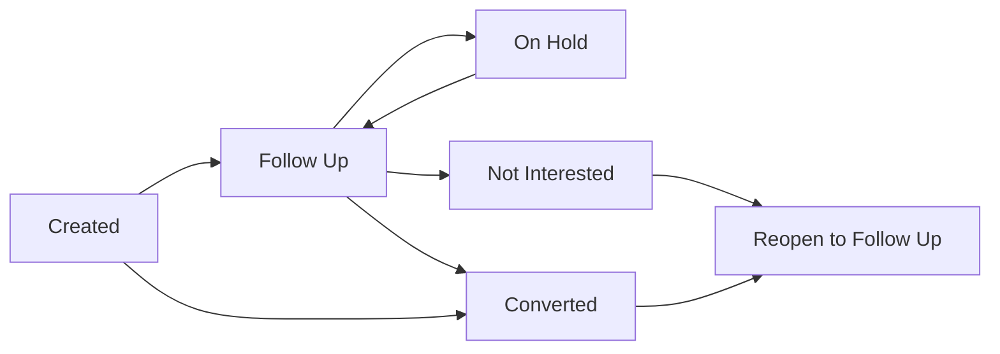

# B2B Marketing Lead — BA / UAT Functional Testing Guide

Non-technical functional guide for Business Analysts. Use menu names, buttons, statuses, and expected results only. No technical setup beyond the short pre-test checklist.

**Product name:** B2B Marketing Lead  
**Menu labels you may see:** **B2B Leads**, **B2B Lead Follow-Ups** (under Marketing)

---

## 1. What this module does

Capture interest from **companies / trade partners** (dealers, distributors, EPC, etc.), assign a sales executive, nurture with follow-ups, move through a sales pipeline, and **convert the lead into a B2B Client**.

This is **not** the same as **Marketing Leads** (consumer / Meta leads that convert to an **Inquiry**). Do not mix the two modules when testing.

---

## 2. Setup before testing

| # | Need | Why |
|---|------|-----|
| 1 | User with access to **B2B Leads** (and ideally Follow-Ups + Analysis) | Menu and screens open |
| 2 | At least one **Lead Source** in masters | Required on Create |
| 3 | At least two **sales users** (to assign / reassign) | Assign and visibility tests |
| 4 | Optional: a few **B2B products** | Products of Interest on the form |
| 5 | Optional: valid and invalid **GSTIN / PAN / email** samples | Format validation tests |
| 6 | Optional: sample files (PDF/image) | Document upload on Details |

**Role note (for BA):**

| Role (typical) | What you should see |
|----------------|---------------------|
| SuperAdmin / Sales Manager | All leads; delete usually allowed |
| Sales Executive / Representative | Usually **their team’s** leads only; **no delete** |

If a button or menu is missing, note the role and continue with other cases.

---

## 3. Screens map

| Menu / screen | Path | Use when |
|---------------|------|----------|
| B2B Leads | `/b2b-leads` | Main board — Kanban or List |
| Add B2B Lead | `/b2b-leads/add` | Create a new lead |
| Edit B2B Lead | `/b2b-leads/edit?id=…` | Update an open lead |
| B2B Lead Details | `/b2b-leads/view?id=…` | View, follow-up, convert, documents, timeline |
| Assign B2B Leads | `/b2b-leads/assign` | Bulk reassignment |
| B2B Leads Analysis | `/b2b-leads/analysis` | KPIs, funnel, risks, Excel export |
| B2B Lead Follow-Ups | `/b2b-lead-followup` | Today / Overdue / Tomorrow work queue |

### Main board toolbar (`/b2b-leads`)

| Button | Expected |
|--------|----------|
| Add Lead | Opens Add screen |
| Assign Leads | Opens Assign screen |
| Export | Downloads Excel for current filters |
| Analysis | Opens Analysis screen |
| List View / Kanban View | Toggles view on same page |
| Home | Goes to home |

---

## 4. Lifecycle at a glance

### Lead status (Kanban columns)

| Status | Meaning | Open or closed? |
|--------|---------|-----------------|
| **Created** | New lead, not yet worked | Open |
| **Follow Up** | Active nurturing | Open |
| **On Hold** | Paused temporarily | Open |
| **Converted** | Became a B2B Client | Closed |
| **Not Interested** | Lost / declined | Closed |

**Open statuses:** Created, Follow Up, On Hold  
**Closed statuses:** Converted, Not Interested — Edit and Kanban drag are blocked; use **Reopen to Follow-up** to bring back.

### Pipeline stage (separate from status)

Shown on Edit and Details (e.g. “Stage: contacted”).

**Order:** New → Contacted → Qualified → Proposal → Negotiation → **Won** / **Lost**

| When status becomes… | Pipeline stage usually becomes… |
|----------------------|----------------------------------|
| Created | New |
| Converted | Won |
| Not Interested | Lost |

**Lost reasons** (when stage is Lost): Not Interested, Price, Competitor, Budget, Timing, No Response, Other.

### Priority

Low | Medium | High (default on create: **Medium**)

---

## 5. End-to-end happy path

Run this once per environment after setup.

| Step | Action | Expected |
|------|--------|----------|
| 1 | Open **B2B Leads** → **Add Lead** | Add form opens |
| 2 | Fill required fields → **Create Lead** | Success; opens **B2B Lead Details**; Lead Number shown; Status **Created** |
| 3 | Return to board; find card in **Created** | Company name visible on Kanban |
| 4 | Open **Assign Leads**; select the lead; choose another user; Assign | “Leads assigned successfully”; Assigned To updates |
| 5 | On card menu or Details → **Schedule follow-up** (Once or Recurring) | Next Follow-Up date set; status moves toward Follow Up |
| 6 | On Details → **Log Follow-Up** (channel + outcome e.g. Follow Up Needed) | “Follow-up saved”; row appears under **Follow-Up History** |
| 7 | Optionally set **Pipeline Stage** on Edit (e.g. Contacted → Qualified) | Stage badge updates on Details |
| 8 | On Details → **Convert to Client** (confirm) **or** follow-up outcome **Converted** → confirm | Status **Converted**; Client code badge; Stage **Won** |
| 9 | Try **Edit Lead** | Blocked / not available for converted lead |
| 10 | Open **Analysis**; check New Leads / Conversions for your period | Numbers move in expected direction |
| 11 | Open **B2B Lead Follow-Ups**; use Today / Overdue | Queue lists open leads with follow-up dates |
| 12 | On main board → **Export** | Excel file downloads |

---

## 6. Functional test cases

Mark each row **Pass / Fail / N/A** during UAT.

### A. Access and navigation

| # | Scenario | Steps | Expected |
|---|----------|-------|----------|
| A1 | Menu visible | Login → look under Marketing for **B2B Leads** | Menu opens `/b2b-leads` |
| A2 | Follow-Ups menu | Open **B2B Lead Follow-Ups** | Queue page title shows |
| A3 | Kanban default | Open B2B Leads | Kanban columns: Created, Follow Up, On Hold, Converted, Not Interested |
| A4 | Switch to List | Click List View | Table columns show (Lead No, Company, Contact, Mobile, City, Status, Priority, Assigned To, Next Follow-Up, Created) |
| A5 | Switch back | Click Kanban View | Kanban returns |
| A6 | Open all toolbar screens | Add, Assign, Analysis, Export | Each opens or downloads as expected |

### B. Create lead

| # | Scenario | Steps | Expected |
|---|----------|-------|----------|
| B1 | Required fields block save | Leave Company Name / Contact Person / Mobile / Lead Source / Assigned To empty; submit | Field errors (“Required”); lead not created |
| B2 | Happy create | Fill all five required + optional data; Create Lead | Details page; Lead Number auto-generated; Status Created; Stage New |
| B3 | Cancel | Click Cancel | Returns to B2B Leads list |
| B4 | Email format | Enter invalid email; submit | Invalid email message |
| B5 | GSTIN format | Enter invalid GSTIN | Format error |
| B6 | PAN format | Enter invalid PAN | Format error |
| B7 | GSTIN fills PAN | Enter valid GSTIN while PAN empty | PAN auto-fills from GSTIN (when empty) |
| B8 | Business Type options | Open Business Type | Dealer, Distributor, Retailer, EPC Company, Installer, Contractor, Manufacturer, Corporate Customer, Government Organization, Trader |
| B9 | Products of Interest | Search and add product + quantity | Product appears on form and on Details after save |
| B10 | Duplicate mobile / GSTIN | Create second lead with same mobile or GSTIN as an existing lead | Warning allowed; create still succeeds (not a hard block) |

**Form sections to spot-check:** Company & Contact | Address & Location | Business Info | Assignment & Tracking | Requirements | Products of Interest | Remarks

### C. Edit lead

| # | Scenario | Steps | Expected |
|---|----------|-------|----------|
| C1 | Edit open lead | From Details → Edit Lead; change City / Priority; Update Lead | Changes saved; return to Details |
| C2 | Lead Number read-only | On Edit | Lead Number cannot be changed |
| C3 | Pipeline stage | Change stage to Proposal / Negotiation | Stage badge updates |
| C4 | Lost reason | Set stage to Lost; pick a Lost Reason | Reason saved |
| C5 | Converted cannot edit | Open a Converted lead → try Edit | Edit blocked or message: converted leads cannot be edited |
| C6 | Not Interested cannot edit | Same for Not Interested | Edit not available / blocked |

### D. List and Kanban

| # | Scenario | Steps | Expected |
|---|----------|-------|----------|
| D1 | Filter by Status | Filter Created / Follow Up | Only matching cards/rows |
| D2 | Filter by Priority | Filter High | Only High priority |
| D3 | Filter Company / City | Enter company or city | List narrows |
| D4 | Filter Assigned To | Pick executive | Only that assignee |
| D5 | Date filters | Created From/To or Next Follow-Up From/To | Matching date range |
| D6 | Card / row → View | Click card or row | Opens Details |
| D7 | Card menu: View / Edit | Open ⋮ on open lead | View and Edit work |
| D8 | Card menu: Schedule follow-up | Open schedule dialog | Once / Recurring options |
| D9 | Card menu: Add follow-up | Log a follow-up | History updates |
| D10 | Drag between open columns | Drag Created → Follow Up (or On Hold) | Outcome / follow-up dialog; status updates after save |
| D11 | Cannot drag closed | Try drag Converted or Not Interested | Drag / edit disabled |
| D12 | Reopen menu | On Converted or Not Interested → Reopen to Follow-up | Lead returns to Follow Up with schedule |

### E. Assign leads

| # | Scenario | Steps | Expected |
|---|----------|-------|----------|
| E1 | Bulk assign | Filter → select one or more → choose Assign To → Assign | Success message; Current Assigned To updates |
| E2 | No user | Select leads; leave Assign To empty; Assign | “Please select assigning user.” |
| E3 | No rows | Assign with nothing selected | “Please select at least one lead.” |
| E4 | Converted excluded | Look for converted leads in assign list | Converted leads not available for assign |

### F. Log follow-up

| # | Scenario | Steps | Expected |
|---|----------|-------|----------|
| F1 | Outcome required | Save without Outcome | “Please select outcome” |
| F2 | Channels | Open Channel dropdown | Call, WhatsApp, Email, Visit, Video Meeting |
| F3 | Outcomes | Open Outcome dropdown | Viewed, Follow Up Needed, Callback Scheduled, Converted, No Answer, Switch Off, Not Interested, Wrong Number |
| F4 | Follow Up Needed | Log with Follow Up Needed + notes | Status becomes Follow Up; history row added |
| F5 | Not Interested | Log Not Interested | Status Not Interested; Stage Lost |
| F6 | Convert via follow-up | Choose Converted → confirm step → **Convert to Client** | Lead Converted; Client code; Stage Won |
| F7 | Converted lead form | Open Details of already Converted lead | Log Follow-Up form hidden; Converted option disabled if shown elsewhere |
| F8 | Timeline | On Details click **Timeline** | Activity history (create, assign, stage, follow-up, convert, etc.) |

### G. Schedule and reopen

| # | Scenario | Steps | Expected |
|---|----------|-------|----------|
| G1 | Schedule Once | Set Once + next date + channel → save | “Follow-up scheduled”; Next Follow-Up shows |
| G2 | Schedule Recurring | Set Recurring + interval days (e.g. 15) | Recurring / interval visible on list or details |
| G3 | Interval validation | Enter days less than 1 | “Enter days ≥ 1” |
| G4 | Recurring auto-advance | With Recurring lead, log follow-up **without** a new next date | Next Follow-Up advances by interval days |
| G5 | Close clears schedule | Convert or mark Not Interested | Schedule cleared for closed lead |
| G6 | Reopen | On closed lead → Reopen to Follow-up | Status Follow Up; can schedule again |

### H. Convert to Client

| # | Scenario | Steps | Expected |
|---|----------|-------|----------|
| H1 | Convert from Details | **Convert to Client** → confirm | Success; Client code badge appears; Status Converted; Stage Won |
| H2 | Client data mapping | Open the new B2B Client (if accessible) | Company name, contact, mobile, address, GST/PAN carried across |
| H3 | No re-edit | Try Edit after convert | Blocked |
| H4 | No delete after convert | Try Delete | Converted leads cannot be deleted |
| H5 | Second convert | Convert again (if button still reachable) | Safe — existing client returned; no duplicate client |

### I. Documents (Details)

| # | Scenario | Steps | Expected |
|---|----------|-------|----------|
| I1 | Upload | Documents → + Upload; choose type + file | Document listed |
| I2 | Document types | Open type dropdown | Visiting Card, GST Certificate, Company Profile, PAN Card, Other |
| I3 | Open / download | Open a document | File opens or downloads |
| I4 | Delete | Delete with confirm | Document removed |

### J. Delete

| # | Scenario | Steps | Expected |
|---|----------|-------|----------|
| J1 | Delete open lead | On Created / Follow Up / On Hold → Delete (if your role allows) | Lead removed from board |
| J2 | Delete Converted | Attempt delete on Converted | Blocked |
| J3 | No delete role | Login as Sales Executive (typical) | Delete action not available |

### K. Follow-up queue (`/b2b-lead-followup`)

| # | Scenario | Steps | Expected |
|---|----------|-------|----------|
| K1 | Title | Open page | **B2B Lead Follow-Ups** |
| K2 | Presets | Click Today / Overdue / Tomorrow / All | List refreshes accordingly |
| K3 | Columns | Inspect table | Lead #, Company, Status, Priority, Status/Outcome, Notes, Last Called, Next FU, Assigned To, Channel |
| K4 | Add Follow-Up | Add Follow-Up → search lead → log | Follow-up saved; queue updates |
| K5 | Open lead | View details / Open Lead | Opens B2B Lead Details |
| K6 | Export | Export | Excel downloads |
| K7 | Closed leads | Default queue | Converted / Not Interested usually excluded from day-to-day queue |

### L. Analysis (`/b2b-leads/analysis`)

| # | Scenario | Steps | Expected |
|---|----------|-------|----------|
| L1 | Page title | Open Analysis | **B2B Leads Analysis** |
| L2 | Date presets | Today / 7D / 30D / Quarter / Year | Period changes; KPIs refresh |
| L3 | Advanced filters | Status, Pipeline Stage, Priority, Sources, Executive, Business Type, Industry, City, State | Apply narrows results |
| L4 | KPI cards | Check New Leads, Active Pipeline, Pipeline Value, Conversions, Conversion %, Avg 1st Response, Avg Cycle, Overdue / At Risk | Cards show numbers; clickable where drill-down exists |
| L5 | Panels | Lead & Conversion Trend; Lifecycle Funnel; Follow-up Health; Source Effectiveness; Executive Leaderboard; Priority Mix; Product Demand; Loss Reasons; Market Pulse | Panels render (empty state OK if no data) |
| L6 | Follow-up Health drill | Click Overdue / Due Today / Unscheduled / etc. | Opens Follow-Ups or Leads with matching filter |
| L7 | Export | Export | Analysis Excel downloads |
| L8 | Back | Back | Returns to B2B Leads |

### M. Export (main board)

| # | Scenario | Steps | Expected |
|---|----------|-------|----------|
| M1 | Export all / filtered | Set filters → Export | `.xlsx` downloads; success toast |
| M2 | Filter respected | Export with Status = Created only | File reflects Created leads (spot-check) |

---

## 7. Business rules (quick reference)

| Rule | Behaviour |
|------|-----------|
| Mandatory on create | Company Name, Contact Person, Mobile, Lead Source, Assigned To |
| Duplicate mobile / GSTIN | Warning only — create still allowed |
| Open vs closed | Closed = Converted or Not Interested |
| Edit / Kanban drag | Only open leads |
| Delete | Not for Converted; role may hide Delete |
| Convert target | Creates a **B2B Client** (not an Inquiry) |
| Status ↔ Stage | Converted → Won; Not Interested → Lost |
| Recurring follow-up | Default interval often **15 days**; auto-advances after log if no new date entered |
| Closing a lead | Clears follow-up schedule |
| Reopen | Closed lead can return to Follow Up via Reopen / schedule |
| Timeline | Records create, assign, stage change, follow-up, convert, reopen |
| Team visibility | Executives may only see their team’s assigned leads |
| Out of scope here | Bulk Excel import, Meta / Facebook sync, Call Report, Global Search (those belong to **Marketing Leads**) |

---

## 8. Contrast with Marketing Leads (do not confuse)

| | B2B Marketing Lead | Marketing Leads |
|--|--------------------|-----------------|
| Who | Company / partner | Customer / residential-commercial |
| Convert to | **B2B Client** | **Inquiry** |
| Statuses | Created, Follow Up, On Hold, Converted, Not Interested | New, Viewed, Follow Up, Converted, Not Interested (+ Junk) |
| Priority | Low / Medium / High | Hot / High / Medium / Low |
| Import Excel | No | Yes |
| Call Report | No | Yes |
| Documents on detail | Yes | No |
| Pipeline stages | Yes | No |

---

## 9. Suggested 20-minute smoke script

1. **Add Lead** with all required fields → confirm Lead Number and Created.  
2. **Assign** to another user.  
3. **Schedule** follow-up (Once), then **Log Follow-Up**.  
4. Upload one **Document**.  
5. Open **Timeline** — activity present.  
6. **Convert to Client** — Client code shows; Edit blocked.  
7. **Reopen to Follow-up** on that lead (or use a separate Not Interested lead).  
8. **Analysis** — spot-check KPIs + Export.  
9. **Follow-Ups** queue — Today / Overdue + Export.  
10. Main board **Export**.

---

## 10. Sign-off checklist (BA)

- [ ] Create lead with required fields; Lead Number generated  
- [ ] Validation: missing required, invalid email / GSTIN / PAN  
- [ ] Duplicate mobile or GSTIN warns but still allows create  
- [ ] List and Kanban filters work; drag updates open statuses only  
- [ ] Assign (success + empty user / empty selection messages)  
- [ ] Schedule Once and Recurring; log follow-up with channel + outcome  
- [ ] Convert to Client → Client code; Edit/Delete blocked  
- [ ] Reopen closed lead to Follow Up  
- [ ] Documents: upload / open / delete  
- [ ] Timeline shows key events  
- [ ] Follow-Ups queue presets + Export  
- [ ] Analysis KPIs + Export  
- [ ] Main board Export  
- [ ] Role check: executive sees team scope / no delete (if applicable)  

**Sign-off**

| | |
|--|--|
| Tester name | |
| Date | |
| Environment / tenant | |
| Result | Pass / Pass with observations / Fail |
| Notes | |

---

*Document version: 1 — B2B Marketing Lead (B2B Leads) module functional UAT.*
