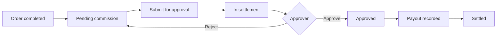

# Commission module — BA / UAT testing guide

Compact functional guide for end-to-end commission testing. No technical setup beyond a short pre-test checklist.

---

## 1. What this module does

When a qualifying order is **completed**, the system accrues commission for the people involved (e.g. person who handled the sale, channel partner). Finance then **submits** selected commission lines for **approval**, an approver **accepts or rejects** the batch, and operations **records payout** once approved. Reports show batch history, paid commission, and per-person ledger statements.

Commission **rates** are configured separately; settlement screens do not change those master rates.

---

## 2. Lifecycle at a glance

### Two levels (read once)

| Level | Meaning | Where you see it |
|-------|---------|------------------|
| **Commission line** | One beneficiary’s commission on one order | Pending commission, Payout, Ledger report |
| **Settlement batch** | Lines submitted together for one approval | Pending approval, Settlement report |

**Line status:** Pending → In settlement → Approved → Settled  

**Batch status:** Pending approval → Approved → Paid (or **Rejected**)

---

## 3. Screens map

| Menu name | URL | Use when |
|-----------|-----|----------|
| User order commission rates | `/user-order-commission-rates` | Set up who earns what (before flow testing) |
| Pending commission | `/commission-settlements/unsettled` | Work queue: select lines and submit for approval |
| Pending approval | `/commission-settlements/pending` | Approve or reject submitted batches |
| Payout | `/commission-settlements/payout` | Pay approved commission |
| Settlement report | `/commission-settlements/report` | View all batches (any status) |
| Settled history | `/commission-settlements/history` | Paid commission only — dashboard and export |
| Ledger report | `/commission-settlements/ledger-report` | Bank-style statement per beneficiary |

**Note:** The menu label is **Pending commission**; the URL still contains `unsettled`.

---

## 4. End-to-end happy path

Use this once per environment after rates and test orders exist.

| Step | Action | Expected |
|------|--------|----------|
| 1 | Confirm commission rates exist for test users (Handled by / Channel partner). | Rates visible on User order commission rates. |
| 2 | Complete a qualifying B2C order (or use existing completed order). | New line(s) appear on **Pending commission**. |
| 3 | Open Pending commission; filter if needed; select line(s) with no red highlight. | Summary shows pending total/count. |
| 4 | Optional: click amount to **adjust** commission; enter reason if amount differs from system. | Adjustment badge on row; preview shows bonus/deduction. |
| 5 | Click **Settle selected**; review preview (payable, gross, offsets). | Preview matches selected lines. |
| 6 | Click **Submit for approval**. | Success message; lines leave Pending commission. |
| 7 | Open **Pending approval**; open the new batch (Review). | Drawer shows lines, totals, submitter. |
| 8 | **Approve** (remarks optional). | Success; batch leaves pending list. |
| 9 | Open **Payout**; find approved lines; select and **Payout selected**. | Success; lines marked paid. |
| 10 | Open **Settlement report**; find batch. | Status **Paid** (or approved then paid per your data). |
| 11 | Open **Settled history**. | Same commission appears as settled; export works if permitted. |
| 12 | Open **Ledger report**; select beneficiary; apply period. | Credits/debits and balance; **no pending lines** in the table. |

---

## 5. Business rules (row colours and behaviour)

| Signal | Meaning | What to do |
|--------|---------|------------|
| **Red row** | Order outstanding is **greater than** total commission on that order | Row cannot be selected; submit/payout blocked |
| **Amber row** | Outstanding will be **deducted on approval** (outstanding ≤ commission) | Select **all** pending lines for that order together, then submit |
| **Bonus / deduction** | Manual change from system-calculated amount | Confirm reason in preview and approval drawer |
| **Reject batch** | Approver rejects the submission | All lines return to **Pending commission**; batch shows **Rejected** on Settlement report |

**Roles on lines:** **Handled by (HB)** and **Channel partner (CP)**. One order may have one or both.

**Ledger vs pending:** **Pending commission** is the only place to work pending lines. **Ledger report** shows in settlement, approved, and settled credits (and payout debits)—not pending.

---

## 6. Screen checklists

### Pending commission

- [ ] Filters: beneficiary, branch, role, dates, order #, amount range
- [ ] Summary KPIs: pending total, line count, approval batches, approved unpaid
- [ ] Adjust commission (if permitted): reason required when amount ≠ system
- [ ] Settle selected → preview → Submit for approval
- [ ] Red: cannot submit; Amber: submit only with all lines for that order

### Pending approval

- [ ] List shows batches awaiting approval (settlement #, total, submitter)
- [ ] Badges: Adjustments, Offset when applicable
- [ ] Review drawer: payable, gross, adjustment summary, offset warning
- [ ] Approve (optional remarks) → lines ready for payout
- [ ] Reject → **remarks required** → lines back on Pending commission

### Payout

- [ ] KPIs: approved unpaid, line count, paid MTD (respect filters when applied)
- [ ] Only **approved** unpaid lines listed
- [ ] Payout selected → confirm → success
- [ ] Red rows not selectable (same outstanding rule)
- [ ] Open settlement detail from row when needed

### Settlement report

- [ ] Filter by batch status: Pending approval, Approved, Paid, Rejected
- [ ] Open **Detail** on a batch; figures match approval drawer

### Settled history

- [ ] Only **settled (paid)** commission
- [ ] Dashboard totals and charts update with filters
- [ ] Lines / By order tabs; export CSV (if permitted)
- [ ] Order link opens order details

### Ledger report

- [ ] Beneficiary required
- [ ] Statement: date, particulars, debit, credit, balance, status
- [ ] KPIs: Opening, Credits, Debits, Closing, In settlement, Approved, Settled
- [ ] **No pending** rows in table or export
- [ ] Checkbox *Include in-settlement & approved* — when off, settled credits + payouts only
- [ ] Export CSV and Print

---

## 7. Regression scenario pack

| ID | Scenario | Where | Pass if |
|----|----------|-------|---------|
| **HP-1** | Single clean line, no outstanding issue | Pending → Approval → Payout → History | Line reaches Settled history; batch Paid |
| **HP-2** | Same order: HB + CP lines in one batch | Pending approval drawer | Both roles/lines visible; approve once |
| **HP-3** | Amber offset order | Pending + Approval | Warning in preview/drawer; payable lower after approve |
| **NEG-1** | Outstanding blocks commission | Pending commission | Red row; cannot submit (seed **S5**) |
| **NEG-2** | Partial selection on offset order | Pending commission | Error until all lines for that order selected (seed **S6**) |
| **NEG-3** | Reject batch | Pending approval → Pending commission | Lines reappear; can resubmit |
| **NEG-4** | Blocked at payout | Payout | Red row not payable |
| **RPT-1** | Ledger for beneficiary with mixed data | Ledger report | No pending status; closing balance consistent |
| **RPT-2** | Rejected batch audit | Settlement report | Batch status Rejected; detail readable |

**Seed mapping (optional):** Ask dev to refresh test data with commission seed “all cases”. Then: **S1–S4** → Pending approval; **S5** → Pending commission (blocked); **S6** → Pending commission (amber); bulk lines → Pending commission volume test.

---

## 8. Pre-test checklist

- [ ] Test users can see Commission menu items they need (submit / approve / payout / reports)
- [ ] Commission rates configured for HB and CP test users
- [ ] At least one completed B2C-eligible order—or seeded commission data
- [ ] Cash payment mode and company bank account exist (needed for outstanding-offset scenarios)
- [ ] Optional: fresh seed for repeatable S1–S6 scenarios

---

## 9. Permissions (smoke)

| Activity | Typical role |
|----------|----------------|
| View pending lines and reports | Finance / BA (read) |
| Adjust commission amount | Finance lead (update on Pending commission) |
| Submit for approval | Finance ops (create on Pending commission) |
| Approve / reject batch | Approver / manager (create or update on Pending approval) |
| Record payout | Finance / accounts (create on Payout) |
| Export history / ledger | Same as read access on that screen |

If an action is missing, check user role module permissions before raising a defect.

---

## Appendix: test data refresh

For a full scripted dataset (S1–S6 and bulk pending lines), ask development to run the commission seed “all cases” on your test tenant. Details: `techhind-solar-api/scripts/commission-settlement-seed/README.md`.
