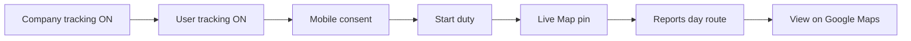

# Location Tracking module — BA / UAT testing guide

Functional guide for configuring and testing Location Tracking end to end (web office screens + mobile duty tracking). Written for BA / UAT — no developer or server setup steps.

---

## 1. What this module does

Field staff can share their location while **on duty** during company **working hours**. The office can:

- See who is **Live**, **Stale**, or has **No data** on a **Live Map**
- Open a person’s current position in **Google Maps**
- Review **day routes** and daily coverage on **Tracking Reports**
- Open a full day’s route (or last point) in **Google Maps**
- Export daily summary data

Tracking only runs when **all** of these are true:

1. Company tracking is **enabled** (Tracking Settings)
2. The user is **enabled for tracking** (User Master)
3. The user has accepted **consent** on the mobile app
4. The user has pressed **Start duty** on the mobile app
5. The phone has location permission, and the time is within (or near) working hours

---

## 2. Lifecycle at a glance

### Status meanings (Live Map)

| Status | Meaning |
|--------|---------|
| **Live** | Recent location received — person appears “online” on the map |
| **Stale** | Person is tracked, but last location is older than expected (missed syncs or stopped moving updates) |
| **No data** | Tracking is allowed for the user, but no location has been received yet (or never started duty / no consent) |

---

## 3. Screens map

### Web (office)

| Menu name | Path | Use when |
|-----------|------|----------|
| Live Map | Location Tracking → **Live Map** | See people on the map right now; open Google Maps for a point |
| Tracking Reports | Location Tracking → **Tracking Reports** | Day-by-day coverage, distance, and route of day |
| Tracking Settings | Location Tracking → **Tracking Settings** | Company master switch, intervals, working hours |
| User Master | Settings / User Master → edit user | Turn tracking on for a person; optional interval overrides |
| Role Master | Role / module permissions | Decide which roles see Live / Reports / Settings |

### Mobile (field)

| Screen | Use when |
|--------|----------|
| **Duty** / location tracking (shown when tracking is enabled for the logged-in user) | Accept consent, Start / Stop duty, Sync queue |

If tracking is **not** enabled for the account, the mobile screen shows that tracking is not enabled — no Start duty.

---

## 4. Platform configuration (do this before testing)

Configure in this order.

### Step A — Tracking Settings (company)

Open **Location Tracking → Tracking Settings**.

| Setting | What it means | Typical test value |
|---------|---------------|--------------------|
| **Enable location tracking for this tenant** | Master switch for the whole company | **ON** |
| **Default capture interval (min)** | How often the phone samples GPS | `5` (allowed range roughly 1–60) |
| **Default sync interval (min)** | How often the phone uploads locations | `10` (must be **≥** capture; floor is usually 5) |
| **Min accuracy (m)** | Ignore very inaccurate GPS fixes | `150` |
| **Working-hours grace (min)** | Soft buffer before/after working hours | `15` |
| **Raw ping retention (days)** | How long detailed location history is kept | `365` |
| **Timezone** | Used for working hours and “day” on reports | `Asia/Kolkata` |
| **Working hours** | Per weekday: On + Start / End times | e.g. Mon–Sat 09:30–18:30; Sun off |

**Rules to remember**

- If the company switch is **OFF**, User Master will not treat users as trackable for operations, and mobile will not track.
- **Sync interval must be greater than or equal to capture interval.**
- Capture below 5 minutes may show a warning (more battery / more data) — still allowed if intentional.
- For UAT outside normal office hours, temporarily widen working hours (or turn on the day you are testing) so Start duty can collect locations.

Click **Save**. Confirm the subtitle still shows how many users are flagged for tracking after you enable users (Step B).

### Step B — User Master (per person)

Open **User Master** → edit a field user (e.g. Field Tech).

| Setting | What it means |
|---------|---------------|
| **Enable location tracking for this user** | This person may be tracked |
| **Capture interval** (optional) | Leave blank to use company default; or set a personal value |
| **Sync interval** (optional) | Leave blank to use company default; must still be ≥ capture |

Save the user.

Repeat for each person you want on Live Map during UAT.

### Step C — Role permissions (who sees which screens)

Super Admin typically already sees all Location Tracking menus.

For other office roles (manager, ops):

| Module / screen | Grant so they can… |
|-----------------|--------------------|
| **Live Map** | Open Live Location Map |
| **Tracking Reports** | Open reports, day route, export |
| **Tracking Settings** | Change company tracking settings (usually admins only) |

Users **without** Live Map permission should not see that menu (or should be blocked from the page).

Mobile Duty screen is based on **user tracking enabled**, not on Live Map role permission.

---

## 5. Pre-test checklist

| # | Check | Ready? |
|---|--------|--------|
| 1 | Test web URL opens and you can log in (dedicated test — leave tenant key blank if asked) | ☐ |
| 2 | Test mobile APK installed (same test environment) | ☐ |
| 3 | Super Admin (or role with Settings + Live + Reports) available | ☐ |
| 4 | At least one field user account available for mobile | ☐ |
| 5 | Company Tracking Settings: **Enabled = ON**, working hours cover the test time | ☐ |
| 6 | Field user: **Location tracking enabled = ON** | ☐ |
| 7 | Phone: location permission allowed for TechHind app | ☐ |
| 8 | Phone has GPS / network; tester can move or stay outdoors briefly | ☐ |

---

## 6. End-to-end happy path

Use once per environment after configuration (section 4).

| Step | Who | Action | Expected |
|------|-----|--------|----------|
| 1 | Admin (web) | Tracking Settings → Enable ON → Save | Settings saved; no error |
| 2 | Admin (web) | User Master → enable tracking for field user → Save | User saved |
| 3 | Field (mobile) | Log in as that field user | Login success |
| 4 | Field (mobile) | Open Duty / tracking screen | Screen loads (not “not enabled”) |
| 5 | Field (mobile) | If asked: **I agree and continue** (consent) | Consent recorded; Start duty becomes available |
| 6 | Field (mobile) | **Start duty** | Duty shows **Active**; notification / status indicates tracking |
| 7 | Field (mobile) | Wait at least one sync interval (or tap **Sync queue now**) | No persistent error snackbar |
| 8 | Admin (web) | Open **Live Map** → Refresh | Field user appears; status Live or Stale; pin on map |
| 9 | Admin (web) | Click user row or pin → **Google** / **View on Google Maps** | Google Maps opens for that location |
| 10 | Admin (web) | After some movement / time: **Tracking Reports** → choose date → click row | Day route draws on map; start/end markers if multiple points |
| 11 | Admin (web) | **View route on Google Maps** (or **Open last point** if only one ping) | Google Maps opens |

---

## 7. Test cases (detailed)

Mark Pass / Fail / Blocked for each.

### Configuration

| ID | Scenario | Steps | Expected | Result |
|----|----------|-------|----------|--------|
| LT-01 | Company master ON | Settings → enable → Save → reopen page | Checkbox stays ON | |
| LT-02 | Company master OFF | Disable → Save | Tracking off; field users should not start meaningful tracking | |
| LT-03 | Interval validation | Set sync **lower** than capture → Save | Error / blocked; must fix sync ≥ capture | |
| LT-04 | Working hours day off | Turn Sunday (or today) **Off** → Save | That day treated as non-working for tracking hours | |
| LT-05 | User enable | User Master → enable tracking → Save | User can use Duty screen | |
| LT-06 | User disable | Disable tracking on user → Save | Mobile shows tracking not enabled; disappears from useful Live tracking | |

### Roles & menu

| ID | Scenario | Steps | Expected | Result |
|----|----------|-------|----------|--------|
| LT-07 | Super Admin menus | Log in as Super Admin | Sees Location Tracking → Live, Reports, Settings | |
| LT-08 | Role without Live | Role without Live Map permission | Live Map not available / blocked | |
| LT-09 | Role with Reports only | Grant Reports only | Can open Reports; cannot open Settings (if not granted) | |

### Mobile duty

| ID | Scenario | Steps | Expected | Result |
|----|----------|-------|----------|--------|
| LT-10 | Consent required first | New tracked user opens Duty | Consent text + **I agree and continue** before Start duty | |
| LT-11 | Start duty | After consent → Start duty | Duty = Active | |
| LT-12 | Stop duty | Stop duty | Duty = Stopped; location stops updating after a short time | |
| LT-13 | Sync queue | With Active duty → Sync queue now | Success message; queue depth drops toward 0 when online | |
| LT-14 | Location permission denied | Deny location in phone settings | Start duty fails or cannot get useful locations; Live stays No data / Stale | |

### Live Map

| ID | Scenario | Steps | Expected | Result |
|----|----------|-------|----------|--------|
| LT-15 | Map shows streets | Open Live Map | Map background (streets) visible — not a blank grey area only | |
| LT-16 | Pin for active user | After Start duty + sync | Pin on map; list shows user with age / battery when available | |
| LT-17 | Filters | Use Live / Stale / No data filters | List filters correctly; KPIs match | |
| LT-18 | Search | Search by name or email | Matching users only | |
| LT-19 | Focus on map | Click user row | Map focuses that user; popup can open | |
| LT-20 | Google from list | Click **Google** on a user with position | Google Maps opens at lat/long | |
| LT-21 | Google from popup | Open marker popup → **View on Google Maps** | Google Maps opens | |
| LT-22 | Refresh | Click Refresh | Poll time updates; data refreshes | |

### Reports

| ID | Scenario | Steps | Expected | Result |
|----|----------|-------|----------|--------|
| LT-23 | Date range | Set From / To → load | Summary rows or empty message | |
| LT-24 | Day route | Click a summary row | Route of day panel + map path (if points exist) | |
| LT-25 | Google route | With trail loaded → **View route on Google Maps** | Google Maps directions / route opens | |
| LT-26 | Single point | Only one ping that day → **Open last point** | Google Maps opens that point | |
| LT-27 | Export | Export for the selected range | File downloads; opens in Excel/Sheets | |
| LT-28 | Totals | With data in range | Coverage %, pings, distance, mocked count look sensible | |

### Negative / edge

| ID | Scenario | Steps | Expected | Result |
|----|----------|-------|----------|--------|
| LT-29 | No consent | Skip consent; try to rely on Live | No reliable Live pin until consent + Start duty | |
| LT-30 | Outside working hours | Set hours so “now” is outside; Start duty | Tracking may not collect useful in-hours points; reports may mark outside-hours behaviour | |
| LT-31 | Company OFF mid-test | Turn company OFF while duty was active | New tracking effectively stops for operations | |

---

## 8. Field meanings (Reports — quick reference)

| Column / KPI | Plain meaning |
|--------------|---------------|
| **Coverage %** | How complete the day’s location samples were vs expected |
| **Pings** | Actual samples / expected samples |
| **Distance (km)** | Approximate travel distance from the day’s points |
| **First / Last** | First and last location time that day |
| **Max gap** | Longest quiet stretch between points |
| **Mocked** | Count of locations the device flagged as fake/mock GPS |

---

## 9. Sign-off

| Item | Value |
|------|--------|
| Environment | Test |
| Tester | |
| Date | |
| Happy path (section 6) | Pass / Fail |
| Critical fails (IDs) | |
| Notes | |

---

## 10. Out of scope for BA (do not block UAT on these)

- Server environment variables and deployments (already handled by IT)
- Map provider accounts or Google Maps billing keys (View on Google Maps opens the public Google Maps website; no key in the product)
- Changing mobile build configuration
