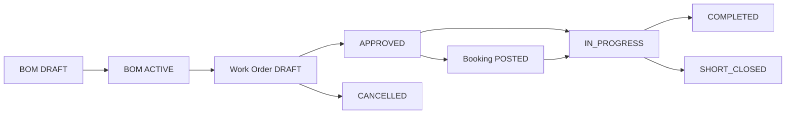

# Production / Assembly — BA / UAT Testing Guide

| Field | Value |
| --- | --- |
| Document type | Functional BA / UAT test pack |
| Module | Production / Assembly |
| Audience | Business Analysts, QA, Operations, Warehouse |
| Environment | Web: `http://localhost:3000` · API: `http://127.0.0.1:5142/api` |
| UI terminology | **Work Order** (menu label; not "Production Order") |
| Version | 1.0 |
| Last updated | 2026-09-02 |

---

## 1. Purpose and scope

### 1.1 Purpose

Validate the **Production / Assembly** module end to end: BOM definition, work order planning and approval, warehouse picking, production/assembly booking (component issue + finished-good receipt), inventory and cost impact, dashboard visibility, and document outputs.

This document is **functional only** — screens, fields, business rules, expected results, and pass/fail sign-off. It does not describe system architecture or code.

### 1.2 In scope

- BOM Master (create, activate, clone version, list/filter)
- Work Orders (create, approve, cancel, short close, detail tabs, shortage, PDF/Excel)
- Production/Assembly Booking (backflush, post, serial capture, scrap/rejection)
- Booking History (search, filters, cancel posted booking)
- Production/Assembly Dashboard (KPIs, pipeline, alerts, analytics, export, genealogy)
- RBAC module access smoke
- Inventory ledger transaction types from production posting

### 1.3 Out of scope

- Database migrations and API implementation details
- Automated script internals (`production-module-qa.js` is reference only)
- Customer order, B2B, commission modules (except using their stock inward as prerequisite)
- Screenshot attachments (optional; attach externally during UAT)

---

## 2. Module overview

### 2.1 What this module does

Plan and execute in-house **assembly or kitting** of finished goods (FG) from component materials at a **production warehouse**. Each **booking** issues components and receives FG in one atomic post. Costs roll up to work order and FG weighted average cost.

### 2.2 Work order lifecycle



| Status | Meaning |
| --- | --- |
| **DRAFT** | Created; editable; not yet released for production |
| **APPROVED** | BOM snapshot frozen; ready for bookings |
| **IN_PROGRESS** | At least one booking posted |
| **COMPLETED** | Produced + rejected qty meets planned qty |
| **SHORT_CLOSED** | Closed early with partial output; posted bookings retained |
| **CANCELLED** | Voided before production (no posted bookings) |

### 2.3 Booking lifecycle

| Status | Meaning |
| --- | --- |
| **DRAFT** | Not used for long — booking posts directly in normal flow |
| **POSTED** | Stock and ledger updated; cannot edit or delete |
| **CANCELLED** | Reversal of a posted booking; stock and ledger restored |

---

## 3. Screens map

| Menu name | Route | Module key | Use when |
| --- | --- | --- | --- |
| Production/Assembly Dashboard | `/production-dashboard` | `production_dashboard` | KPIs, pipeline, alerts, export |
| BOM Master | `/production-bom` | `production_bom` | Define recipes and standard costs |
| Work Orders | `/production-orders` | `production_orders` | Plan and approve production runs |
| Production/Assembly Booking | `/production-bookings/new` | `production_bookings` | Post component issue + FG receipt |
| Booking History | `/production-bookings` | `production_bookings_history` | Search bookings; cancel posted |

Parent menu: **Production / Assembly** (`production`).

---

## 4. Business rules summary

| # | Rule |
| --- | --- |
| R1 | Only **ACTIVE** BOM can back a work order |
| R2 | **ACTIVE** BOM cannot be edited in place — **Clone as new version** |
| R3 | Work order editable only in **DRAFT** |
| R4 | **Approve** freezes BOM component snapshot and required quantities |
| R5 | Booking allowed only on **APPROVED** or **IN_PROGRESS** work orders |
| R6 | **Consumed qty** is backflush-calculated and **read-only** on booking form |
| R7 | **Scrap qty** editable; **scrap reason** required when scrap > 0 |
| R8 | Serialized FG: **good + rejected = 1** per booking |
| R9 | **Rejection warehouse** + **rejection reason** required when rejected qty > 0 |
| R10 | Posted bookings **cannot be edited or deleted** |
| R11 | **Cancel** posted booking reverses stock and ledger |
| R12 | Work order **cancel** blocked if any **posted** bookings exist |
| R13 | **Short close** only on APPROVED or IN_PROGRESS |
| R14 | **Insufficient stock** blocks booking post |
| R15 | Serialized components: serial count must equal consumed + scrap |
| R16 | At post: material cost + operation cost = FG production value |
| R17 | Ledger: `PRODUCTION_ISSUE_OUT`, `PRODUCTION_RECEIPT_IN`, `PRODUCTION_SCRAP_OUT`, `PRODUCTION_REJECT_IN`, cancel variants |
| R18 | Dashboard: status tabs, date presets, advanced filter panel, Export All |
| R19 | Work Order PDF and Picklist PDF from work order detail |
| R20 | List screens: quick search + status summary chips |

---

## 5. Prerequisites and sample data

### 5.1 Roles

| Role | Minimum permissions |
| --- | --- |
| Full UAT tester | All `production_*` modules: create, read, update, delete as needed |
| Read-only smoke | `production_dashboard`, `production_orders` read only |

Assign via **Settings → Roles → Module permissions**.

### 5.2 Master data checklist

- [ ] **FG product (lot-tracked)** — for multi-qty bookings
- [ ] **FG product (serial-tracked)** — for single-unit bookings
- [ ] **Component A (serial-required)** — e.g. panel with serial tracking
- [ ] **Component B (lot-tracked)** — e.g. cable without serial
- [ ] **Production warehouse** — active, with component stock on hand
- [ ] **Rejection warehouse** — configured via `production.rejection_warehouse_id` tenant config
- [ ] **ACTIVE BOM** for test FG — components + operations + standard costs

### 5.3 Stock prerequisite

Components must exist at the **production warehouse** before booking post (via PO inward, stock transfer, or adjustment). Shortage on work order detail is informational; post re-validates under lock.

### 5.4 Automated QA reference

Dev team can refresh baseline with:

```bash
cd techhind-solar-api && node testing/production-module-qa.js
```

Fixture note: ENV-07 seeds FG serial/lot products and production/rejection warehouses.

---

## 6. End-to-end happy path (HP-0)

Run once per environment after prerequisites are met.

| Step | Action | Screen | Expected result | Pass / Fail |
| ---: | --- | --- | --- | --- |
| 1 | Create DRAFT BOM for lot-tracked FG; add 2 components + 2 operations | `/production-bom/new` | BOM saved; std material + operation costs calculated | |
| 2 | Activate BOM as default | `/production-bom` | Status ACTIVE; appears as default for FG | |
| 3 | Create work order: FG, production WH, planned qty 10 | `/production-orders/new` | DRAFT work order with order no (PRO000xxx) | |
| 4 | Approve work order | `/production-orders/[id]` | Status APPROVED; component snapshot visible | |
| 5 | Print Picklist PDF | Work order detail | PDF downloads; component lines with on-hand/shortage | |
| 6 | Open Production/Assembly Booking; select work order; good qty 5 | `/production-bookings/new` | Backflush loads; consumed qty filled and **disabled** | |
| 7 | Confirm & Post Booking | Booking form | Success; booking POSTED | |
| 8 | Verify work order detail KPIs | `/production-orders/[id]` | Produced qty updated; status IN_PROGRESS; posted value > 0 | |
| 9 | Verify component stock reduced | `/stocks` or Inventory Ledger | OUT movement for consumed components | |
| 10 | Post remaining qty bookings until planned 10 reached | Booking | Work order status COMPLETED | |

---

## 7. Test case packs

Columns: **ID · Scenario · Screen · Steps · Expected · Pass/Fail · QA ref** (automated script ID if applicable).

### 7.1 Environment and access (ENV / RBAC)

| ID | Scenario | Screen | Steps | Expected result | Pass / Fail | QA ref |
| --- | --- | --- | --- | --- | --- | --- |
| ENV-01 | Login and menu visible | Login → sidebar | Log in as test user | Production / Assembly parent + 5 child menus visible | | ENV-01 |
| ENV-02 | API auth required | Any production API | Call without token | 401 Unauthorized | | ENV-02 |
| ENV-03 | Production tables exist | (Dev) | Confirm tenant migrated | BOM, WO, booking tables present | | ENV-03 |
| ENV-04 | RBAC modules seeded | Settings → Role modules | Check module master | 6 modules: production + 5 children with correct routes | | ENV-04 |
| ENV-05 | Serial masters seeded | Serial master | Check PRODBOM, PRODORDER, PRODBOOKING | Codes exist for document numbering | | ENV-05 |
| ENV-06 | Ledger constants | (Dev) | Verify transaction types | PRODUCTION_* ledger types defined | | ENV-06 |
| ENV-07 | Test fixtures ready | Stocks + products | Confirm FG + WH fixtures | Serial FG, lot FG, production WH, rejection WH | | ENV-07 |
| RBAC-01 | Invalid token rejected | API | GET `/production-bom` with bad token | 401 | | RBAC-01 |
| RBAC-02 | SuperAdmin module tree | Settings → Roles | SuperAdmin role modules | Production / Assembly parent with nested children | | RBAC-02 |
| RBAC-03 | No permission blocked | Web | User without production_bom opens `/production-bom` | Access denied or redirect | | — |
| RBAC-04 | Read-only booking | Booking | User with read-only on production_bookings | Cannot post; can view history | | — |

### 7.2 BOM Master (BOM)

| ID | Scenario | Screen | Steps | Expected result | Pass / Fail | QA ref |
| --- | --- | --- | --- | --- | --- | --- |
| BOM-01 | Create DRAFT BOM | `/production-bom/new` | FG + 2 components + 2 operations | DRAFT BOM; std costs calculated; bom_code generated | | BOM-01 |
| BOM-02 | FG as own component | Create BOM | Set FG as component line | Error: cannot be component of own BOM | | BOM-02 |
| BOM-03 | Duplicate component | Create BOM | Same component twice | Error: repeated component | | BOM-03 |
| BOM-04 | Empty components | Create BOM | No component lines | Error: at least one component | | BOM-04 |
| BOM-05 | Activate BOM | BOM detail/list | Activate as default | Status ACTIVE | | BOM-05 |
| BOM-06 | Edit ACTIVE BOM | BOM edit | Open ACTIVE BOM edit | Blocked; must clone version | | BOM-06 |
| BOM-07 | Default BOM resolution | Work order create | Select FG with active default BOM | Active BOM auto-selected | | BOM-07 |
| BOM-08 | Clone new version | BOM list | Clone ACTIVE BOM | New DRAFT with incremented version | | BOM-08 |
| BOM-09 | Lot FG BOM activate | BOM | Activate lot-tracked FG BOM | ACTIVE; usable on work order | | BOM-09 |
| BOM-10 | List filters | `/production-bom` | Filter by status, FG, default | Correct rows; component_count shown | | BOM-10 |
| BOM-UI-01 | Quick search | BOM list | Search by bom_code | Matching BOM returned | | — |
| BOM-UI-02 | Deactivate BOM | BOM list | Deactivate ACTIVE BOM | Status INACTIVE; not selectable for new WO | | — |

### 7.3 Work Orders (ORD)

| ID | Scenario | Screen | Steps | Expected result | Pass / Fail | QA ref |
| --- | --- | --- | --- | --- | --- | --- |
| ORD-01 | Create DRAFT WO | `/production-orders/new` | FG, WH, planned qty, BOM | DRAFT order no assigned | | ORD-01 |
| ORD-02 | Planned qty required | Create WO | Submit without planned qty | Validation error | | ORD-02 |
| ORD-03 | Approve snapshot | WO detail | Approve DRAFT order | APPROVED; components with required qty | | ORD-03 |
| ORD-04 | No edit after approve | WO detail | Edit button on APPROVED | Edit not available | | ORD-04 |
| ORD-05 | Shortage view | WO detail → Components | Review shortage columns | Required, issued, on-hand, shortage shown | | ORD-05 |
| ORD-06 | Lot FG order approve | WO | Approve lot FG work order | APPROVED successfully | | ORD-06 |
| ORD-UI-01 | Status summary chips | `/production-orders` | View list header chips | Counts per status (DRAFT, OPEN, etc.) | | DSH-06 |
| ORD-UI-02 | Advanced filters | WO list | Open filter panel; filter WH/FG/dates | List refreshes correctly | | — |
| ORD-UI-03 | Quick search | WO list | Search by order no | Matching work order returned | | DSH-06 |
| ORD-UI-04 | Print Work Order PDF | WO detail | Click Print Work Order | PDF downloads; valid PDF content | | WO-PDF-01 |
| ORD-UI-05 | Print Picklist PDF | WO detail | Click Print Picklist | PDF downloads; picklist lines | | WO-PDF-02 |
| ORD-UI-06 | Export Report Excel | WO detail | Click Export Report | XLSX downloads with multiple sheets | | DSH-07 |
| ORD-UI-07 | Short close | WO detail | Short close IN_PROGRESS WO with reason | SHORT_CLOSED; bookings retained | | CMP-03 |
| ORD-UI-08 | Cancel DRAFT WO | WO detail | Cancel DRAFT with no bookings | CANCELLED | | — |
| ORD-UI-09 | Invalid PDF id | API/browser | Request PDF for non-existent id | 404 error | | WO-PDF-04 |
| ORD-UI-10 | Detail tabs | WO detail | Open Overview, Components, Bookings, Cost, Audit | Each tab loads data | | DSH-05 |

### 7.4 Booking validation (BK)

| ID | Scenario | Screen | Steps | Expected result | Pass / Fail | QA ref |
| --- | --- | --- | --- | --- | --- |
| BK-01 | Backflush preview | `/production-bookings/new` | Select WO; enter good qty | Components load; unit cost preview | | BK-01 |
| BK-02 | Serialized FG qty rule | Booking | Serial FG; good+rejected ≠ 1 | Validation error | | BK-02 |
| BK-03 | FG serial required | Booking | Serial FG; omit FG serial | Validation error | | BK-03 |
| BK-04 | Component serial count | Booking | Serial component; wrong serial count | Validation error | | BK-04 |
| BK-05 | Duplicate serial | Booking | Enter same serial twice | Error: duplicate serial | | BK-05 |
| BK-06 | Unknown serial | Booking | Enter non-existent serial | Error: not available | | BK-06 |
| BK-07 | Mandatory component | Booking | Optional line ok; mandatory line consumed=0 | Error on mandatory component | | BK-07 |
| BK-08 | Scrap reason | Booking | Scrap > 0 without reason | Validation error | | BK-08 |
| BK-09 | Insufficient stock | Booking | Post with qty > on-hand | Post blocked with stock message | | BK-09 |
| BK-10 | Off-snapshot component | Booking | Add component not on WO snapshot | Rejected | | BK-10 |
| BK-11 | Rejection warehouse | Booking | Rejected qty > 0; no rejection WH | Validation error | | BK-11 |
| BK-12 | Validate serials API | Booking | Use validate-serials action | Available vs unknown separated | | BK-12 |
| BK-UI-01 | Consumed qty read-only | Booking form | Inspect Consumed column | Field disabled; cannot edit | | — |
| BK-UI-02 | Scrap qty editable | Booking form | Change scrap qty | Field accepts input; variance updates | | — |
| BK-UI-03 | Remaining qty cap | Booking | Enter good qty > WO remaining | Error: exceeds remaining | | CMP-02 |

### 7.5 Posting and inventory (POST)

| ID | Scenario | Screen | Steps | Expected result | Pass / Fail | QA ref |
| --- | --- | --- | --- | --- | --- | --- |
| POST-01 | Post serialized booking | Booking | Complete serial FG booking post | POSTED; success message | | POST-01 |
| POST-03 | Component stock OUT | Stocks / Ledger | After post | Component qty reduced | | POST-03 |
| POST-04 | FG stock IN | Stocks | After post | FG qty increased at production WH | | POST-04 |
| POST-05 | Component serial ISSUED | Serial inquiry | After post | Serial status ISSUED against booking | | POST-05 |
| POST-06 | FG serial AVAILABLE | Serial inquiry | After post | New FG serial at unit cost | | POST-06 |
| POST-07 | Ledger consistency | Inventory Ledger | Filter production txn types | OUT + IN rows for booking | | POST-07 |
| POST-08 | Cost conservation | WO Cost tab | Compare material + ops vs total | Values match booking total | | POST-08 |
| POST-09 | FG WAC updated | Stocks / product cost | Check FG WAC after post | WAC reflects production cost | | POST-09 |
| POST-10 | WO rollups | WO detail | After first post | IN_PROGRESS; produced qty updated | | POST-10 |
| POST-11 | No edit posted | Booking History | Try edit posted booking | Not allowed | | POST-11 |
| POST-12 | No delete posted | Booking History | Try delete posted booking | Not allowed | | POST-12 |
| POST-13 | WO cancel with posts | WO detail | Cancel WO with posted booking | Error: use short close | | POST-13 |
| POST-14 | Second booking same WO | Booking | Post another booking on IN_PROGRESS WO | Allowed until planned qty reached | | POST-14 |

### 7.6 Scrap, rejection, overproduction (SCR / REJ / OVR)

| ID | Scenario | Screen | Steps | Expected result | Pass / Fail | QA ref |
| --- | --- | --- | --- | --- | --- | --- |
| SCR-01 | Scrap on booking | Booking | Post with scrap qty + reason | POSTED; extra component issued | | SCR-01 |
| SCR-02 | Scrap ledger | Inventory Ledger | After scrap booking | PRODUCTION_SCRAP_OUT entry | | SCR-02 |
| SCR-03 | Scrap stock qty | Stocks | Compare before/after | Stock reduced by consumed + scrap | | SCR-03 |
| REJ-01 | Full rejection booking | Booking | good=0, rejected=1 (serial FG) | POSTED to rejection WH | | REJ-01 |
| REJ-02 | WO rejected rollup | WO detail | After rejection booking | rejected qty incremented; produced unchanged | | REJ-02 |
| OVR-01 | Over planned qty | Booking | Post qty > remaining (no tolerance) | Blocked unless tolerance configured | | OVR-01 |
| REJ-UI-01 | Rejection reason required | Booking | rejected > 0; blank reason | Validation error | | BK-11 |
| REJ-UI-02 | Reject WH on booking | Booking | Set rejection warehouse on form | Used when posting rejects | | — |

### 7.7 Completion and cancellation (CMP / CAN)

| ID | Scenario | Screen | Steps | Expected result | Pass / Fail | QA ref |
| --- | --- | --- | --- | --- | --- | --- |
| CMP-01 | Complete work order | Booking + WO | Post until planned qty met | WO status COMPLETED | | CMP-01 |
| CMP-02 | Exceed remaining | Booking | Post more than pending qty | Validation/post error | | CMP-02 |
| CMP-03 | Short close | WO detail | Short close partial WO | SHORT_CLOSED; posted bookings kept | | CMP-03 |
| CAN-01 | Cancel posted booking | Booking History | Cancel with reason | CANCELLED; stock restored | | CAN-01 |
| CAN-02 | Stock restored qty | Stocks | After cancel | Component stock returned | | CAN-02 |
| CAN-03 | Ledger on cancel | Inventory Ledger | After cancel | PRODUCTION_CANCEL_IN/OUT entries | | CAN-03 |
| CAN-04 | WO qty after cancel | WO detail | Cancel booking that contributed qty | produced/rejected rollbacks correct | | CAN-04 |
| CAN-05 | Cancel WO with posts | WO detail | Cancel after posted booking | Blocked | | CAN-05 |
| CAN-06 | Serial restored | Serial inquiry | Cancel booking with serials | Component serial AVAILABLE; FG serial blocked | | CAN-06 |
| CAN-07 | Re-use serial | Booking | Re-book with restored serial | Serial validates consumable | | CAN-07 |

### 7.8 Dashboard and reporting (DSH)

| ID | Scenario | Screen | Steps | Expected result | Pass / Fail | QA ref |
| --- | --- | --- | --- | --- | --- | --- |
| DSH-01 | Dashboard KPIs | `/production-dashboard` | Load page | KPI cards populate | | DSH-01 |
| DSH-02 | Warehouse filter | Dashboard | Apply warehouse filter | KPIs/pipeline reflect filter | | DSH-02 |
| DSH-03 | Serial genealogy | Dashboard panel | Enter posted FG serial | Booking + consumed serials shown | | DSH-03 |
| DSH-04 | WO booking count | WO detail | Open WO with bookings | Bookings tab matches history | | DSH-04 |
| DSH-05 | Detail aggregate | WO detail API/UI | Load detail for test WO | Bookings, rollup, components present | | DSH-05 |
| DSH-06 | WO quick search | `/production-orders` | Search by order no | Correct WO in results + summary | | DSH-06 |
| DSH-07 | WO Excel export | WO detail | Export Report | XLSX > 100 bytes; opens in Excel | | DSH-07 |
| DSH-08 | Booking history search | `/production-bookings` | Quick search + summary chips | POSTED/DRAFT/CANCELLED counts; rows match | | DSH-08 |
| DSH-09 | Dashboard export all | Dashboard | Export All | Multi-sheet XLSX downloads | | DSH-09 |
| DSH-UI-01 | Status quick tabs | Dashboard | Click Approved / In Progress tabs | Pipeline and lists filter | | — |
| DSH-UI-02 | Date presets | Dashboard | Today / This week / This month | Data refreshes for period | | — |
| DSH-UI-03 | Refresh + Export bar | Dashboard | Refresh; Export All | No layout break; data updates | | — |
| DSH-UI-04 | Alert panel | Dashboard | Review alerts section | Shortage/overdue/rejection alerts when data exists | | — |
| DSH-UI-05 | Worklists drill-down | Dashboard | Click work order in worklist | Navigates to WO detail | | — |
| DSH-UI-06 | Analytics charts | Dashboard | Scroll to charts | Trend/variance charts render | | — |

---

## 8. Screen checklists

### 8.1 BOM Master (`/production-bom`)

- [ ] Quick search by code/name/FG
- [ ] Column filters: status, default flag, FG product
- [ ] Create new BOM → DRAFT saved
- [ ] Edit DRAFT BOM (components + operations)
- [ ] Activate / deactivate actions
- [ ] Clone as new version from ACTIVE
- [ ] View detail sidebar: std costs, component count
- [ ] Cannot edit ACTIVE BOM in place

### 8.2 Work Orders (`/production-orders`, `/production-orders/[id]`)

- [ ] Status summary chips on list
- [ ] Advanced filter panel (WH, FG, dates, priority, open-only)
- [ ] Quick search by order no
- [ ] Create DRAFT; edit DRAFT only
- [ ] Approve, cancel, short close actions by status
- [ ] Book Assembly navigates to booking with WO pre-selected
- [ ] Detail KPI cards: planned, produced, rejected, pending, completion, value
- [ ] Tabs: Overview, Components, Bookings, Cost, Audit
- [ ] Print Work Order PDF
- [ ] Print Picklist PDF
- [ ] Export Report Excel

### 8.3 Production/Assembly Booking (`/production-bookings/new`)

- [ ] Work order selector (APPROVED / IN_PROGRESS only)
- [ ] Good + rejected qty; booking date
- [ ] Backflush loads on qty change
- [ ] Consumed qty **disabled** (read-only)
- [ ] Scrap qty + scrap reason editable
- [ ] Variance column updates
- [ ] Serial panel for serialized components
- [ ] FG serial entry when FG is serial-tracked
- [ ] Rejection warehouse + reason when rejecting
- [ ] Cost preview: material, operation, total, unit
- [ ] Confirm & Post Booking

### 8.4 Booking History (`/production-bookings`)

- [ ] Quick search (booking no, WO no, FG name)
- [ ] Status summary: DRAFT, POSTED, CANCELLED
- [ ] Advanced filters (dates, WH, status, WO)
- [ ] Booking detail with component lines and serials
- [ ] Cancel posted booking (with permission + reason)

### 8.5 Production/Assembly Dashboard (`/production-dashboard`)

- [ ] KPI strip loads
- [ ] Status quick tabs + date presets + Reset
- [ ] Advanced filter panel
- [ ] Refresh and Export All
- [ ] Pipeline board by WO status
- [ ] Alert panel
- [ ] Analytics charts
- [ ] Work orders and bookings worklists
- [ ] Serial genealogy lookup

---

## 9. Pre-test checklist

- [ ] Tenant migrated with production tables and RBAC modules (ENV-03, ENV-04)
- [ ] Serial masters PRODBOM / PRODORDER / PRODBOOKING seeded (ENV-05)
- [ ] Production warehouse and rejection warehouse active (ENV-07)
- [ ] Component stock available at production warehouse
- [ ] Test user has required `production_*` role permissions
- [ ] ACTIVE BOM exists for at least one test FG
- [ ] Rejection warehouse config set if testing rejects (R9)
- [ ] Optional: run `node testing/production-module-qa.js` for API baseline before UI UAT

---

## 10. Defect log template

| Defect ID | Test case ID | Steps to reproduce | Expected | Actual | Severity | Status |
| --- | --- | --- | --- | --- | --- | --- |
| | | | | | | |
| | | | | | | |
| | | | | | | |

**Severity:** Critical / High / Medium / Low

**Status:** Open / Fixed / Retest / Closed

---

## 11. Cross-references

| Resource | Location |
| --- | --- |
| Module handbook chapter | [`docs/platform-handbook/modules/18-production-assembly.md`](platform-handbook/modules/18-production-assembly.md) |
| End-to-end workflow | [`docs/platform-handbook/workflows/bom-to-finished-good.md`](platform-handbook/workflows/bom-to-finished-good.md) |
| Customer introduction pack | `npm run docs:production-pack` → `docs/platform-handbook/production-module-pack/output/` |
| Automated API QA | `techhind-solar-api/testing/production-module-qa.js` |
| UI labels | `src/utils/assemblyProductionLabels.js` |

---

## 12. Sign-off

| Role | Name | Date | Result |
| --- | --- | --- | --- |
| Business Analyst | | | Pass / Fail |
| QA Lead | | | Pass / Fail |
| Operations | | | Pass / Fail |
| Product Owner | | | Pass / Fail |

**Notes:**

- Total test cases in Section 7: **96** (ENV/RBAC 10 + BOM 12 + ORD 16 + BK 15 + POST 13 + SCR/REJ 8 + CMP/CAN 10 + DSH 12)
- Map **QA ref** column failures to `production-module-qa.js` for dev investigation
- Re-run HP-0 after any defect fix before full regression
