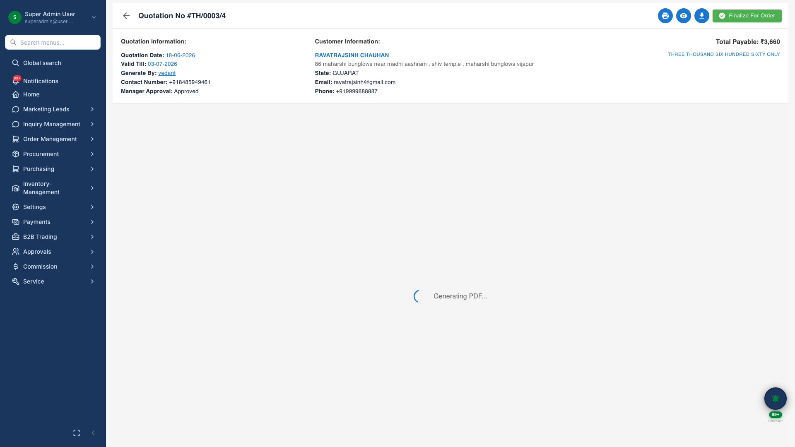
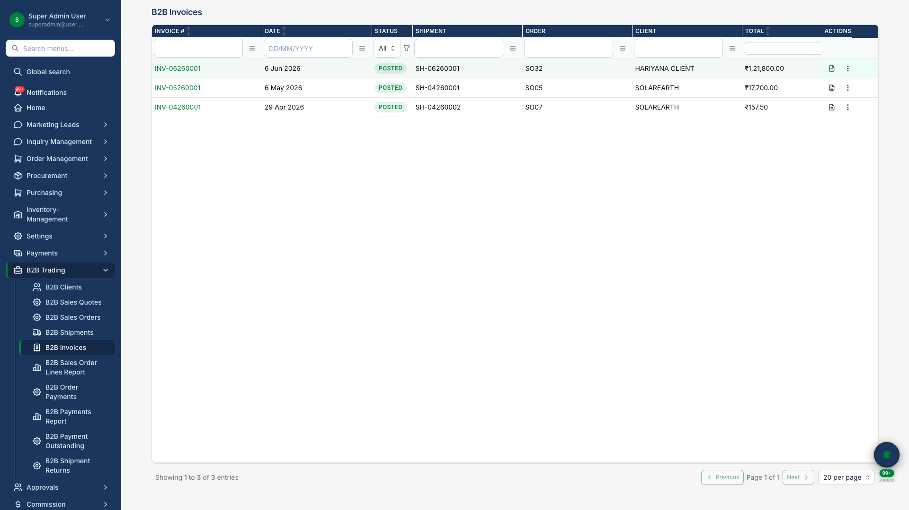

# Document Outputs

## Professional Documents for Customers and Partners

TechHind Solar CRM produces branded, print-ready documents at every stage of the business relationship. These outputs reflect your company identity and can be shared directly with customers, dealers, banks, and DISCOM authorities.

## Quotation PDF

Formal commercial proposals with product line items, pricing, terms and conditions, and technical specifications. Managers approve quotations before PDF generation; sales teams share the document with customers for sign-off.

{.hero}

*Branded quotation with inline PDF preview before sharing with the customer.*

## Order Document

Comprehensive order summary including customer details, project scope, payment schedule, and commercial terms — generated from confirmed project data.

{.hero}

*Order PDF generated from confirmed project data.*

## B2B Invoice

Tax-compliant invoices for dealer and distributor sales, generated from shipments with GST line-item breakdown.

{.hero}

*B2B invoice with line items and client details.*

## Payment Receipt

Receipt PDFs for recorded payments against order milestones — useful for customer acknowledgment and accounts reconciliation.

## Warranty Card

Digital warranty card for installed systems, linked to serial numbers and installation date. Customers can verify warranty status through a public lookup page.

## Delivery Challan

Material dispatch documents for warehouse-to-site delivery, with product quantities and serial numbers where applicable.

## Work Order PDF

Branded production summary for an approved work order: finished good, planned/produced quantities, component snapshot, BOM operations, booking register, and posted cost roll-up. Generated from the work order detail page for office and shop-floor reference.

## Work Order Picklist PDF

Warehouse picking sheet listing all components on a work order with required, issued, outstanding, on-hand, and shortage quantities. Highlights lines with stock shortage. Used before posting a production/assembly booking.

## Why It Matters for Your Business

| Document | Business use |
|----------|--------------|
| Quotation PDF | Win customer trust with professional proposals |
| Order PDF | Formal agreement and project reference |
| B2B Invoice | Dealer billing and GST compliance |
| Payment receipt | Collection proof and customer records |
| Warranty card | After-sales confidence and brand credibility |
| Delivery challan | Logistics proof and inventory traceability |
| Work Order PDF | Production planning and shop-floor reference |
| Work Order Picklist | Component picking and shortage visibility |

All documents use your **company profile** settings — logo, address, bank details, and terms configured once in administration.

---

**Related:** [Quotations](07-quotations.md) · [Order Lifecycle](08-order-lifecycle.md) · [B2B Trading](12-b2b-trading.md) · [Production / Assembly](18-production-assembly.md)
